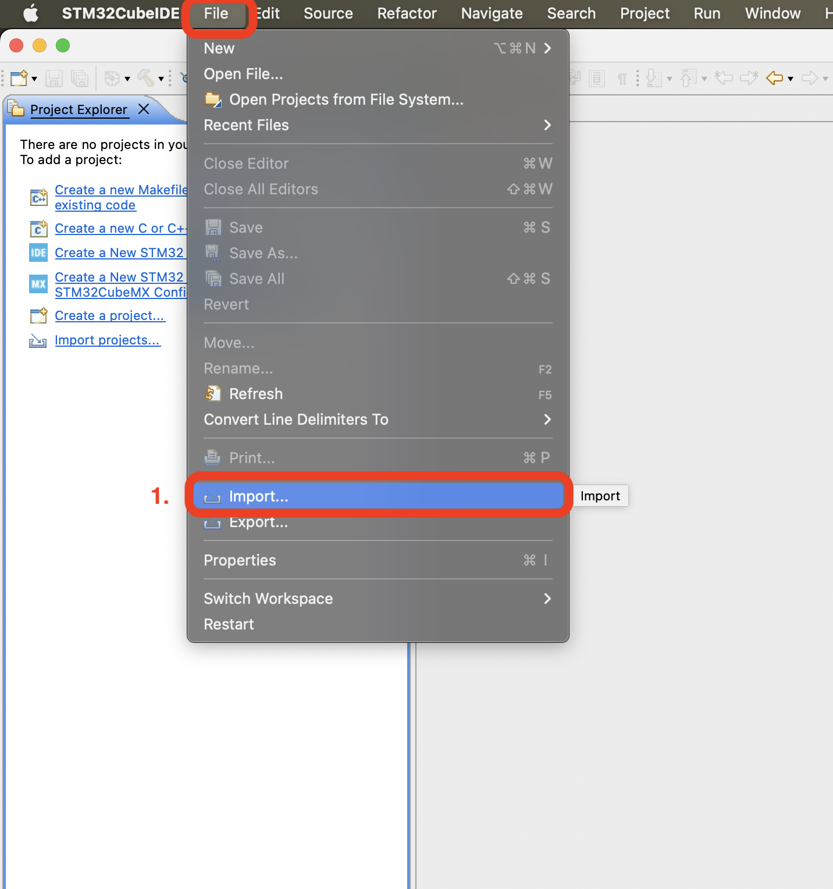
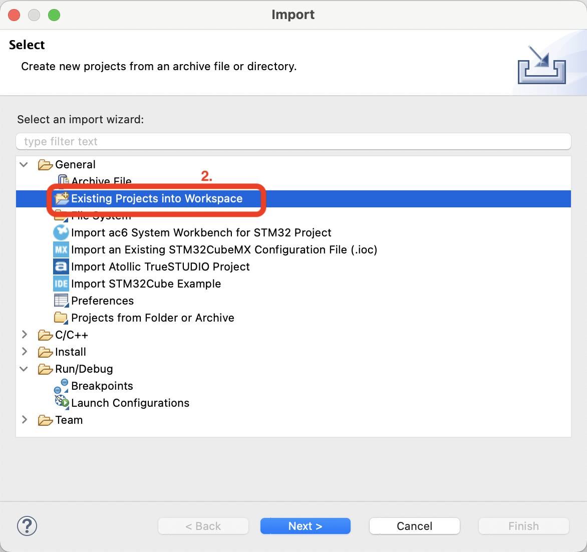
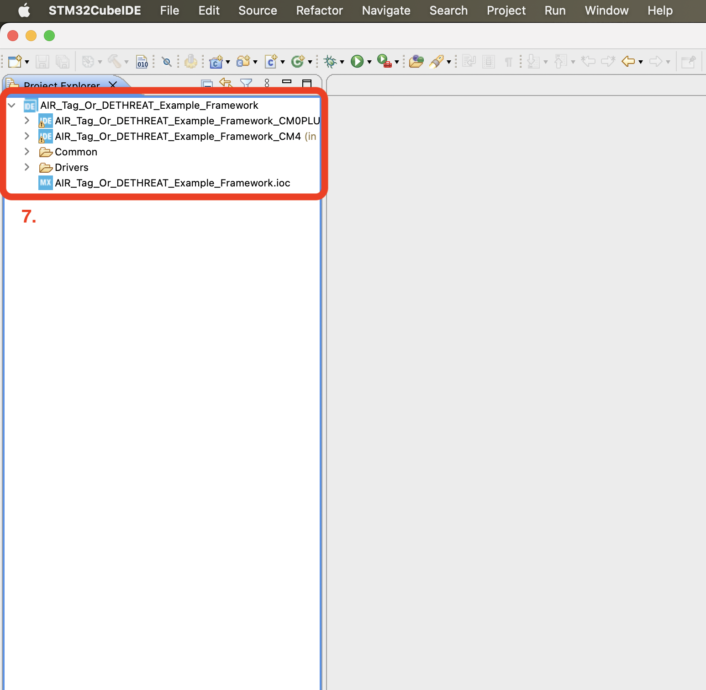

# AIR Tag / DETHREAT Example

This example brings together the [Calendar Module](https://github.com/kgimlay/STM32WL5x-Calendar), [Mode Timer Module](https://github.com/kgimlay/STM32WL5x-Mode-Timer), and the [Desktop Application Communication Module](https://github.com/kgimlay/STM32WL5x-Desktop-Application), and shows how these can be used as a framework for the AIR Tag and DETHREAT projects.

## Installation Instructions

You will be importing the [example project](Example/MCU) provided.

1. Within STM32CubeIDE, navigate to File > Import.
2. Choose "Existing Projects into Workspace".
3. Choose "Browse".
4. Within the [Example](Example) folder provided, select the "AIR_Tag_Or_DETHREAD_Framework" directory and choose "Open".
5. Make sure all three projects are selected (two sub-projects, one for each core, and one parent project).  If three are not present, make sure "Search for nested projects" is selected.
6. Select "Finish".
7. Your project should be imported.  Make sure that the .ioc and two sub-projects are present as shown here.







## Flashing and Debugging

Flashing and debugging is straightforward.

1. Select the sub-project in the project explorer that you want to flash to the MCU and click the green "Upload" button.
2. A window will pop up if this is your first time flashing.  Select Okay.

Make sure that you flash both the cores at the start of the project or after switching between projects.

## End to End Demonstration

### Without Calendar .ics

1. Open a terminal within the folder that your [desktop application python scripts](Example/Desktop) are located in.
2. Make sure the MCU is connected to the desktop and flashed with the example program.
3. Call the desktop application with
```
python3 Desktop_App_Example.py
```
4. The application will upload a testing calendar generated in the python script.  This calendar will start after 10 seconds, stay in an event for 45 seconds and exit for 15 seconds, and will repeat this several times.

Now watch the blue LED on the development board.  It will turn on for 5 seconds and off for 10 for the duration of each event.

### With Calendar .ics

1. Open the calendar app on your computer of your liking.
2. Add a number of events to the calendar making sure none overlap.
3. Export the calendar to an .ics file.  Keep note of its location.
4. Open a terminal within the folder that your [desktop application python scripts](Example/Desktop) are located in.
5. Make sure the MCU is connected to the desktop and flashed with the example program.
5. Call the desktop application with
```
python3 Desktop_App_Example.py <exported>.ics
```
6. The application will upload the calendar and disconnect from the MCU.

Now watch the blue LED on the development board.  It will turn on for 5 seconds and off for 10 for the duration of each event.  I recommend making events short so that you don't have to sit and watch all day!